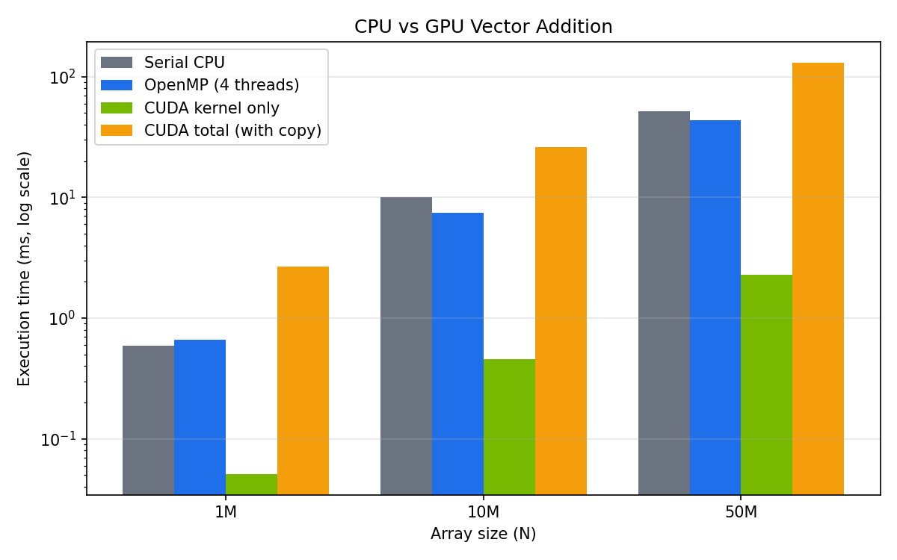

# PGC Lab Evaluation 1 - Team 10: CPU vs GPU Data Processing

**Parallel models:** OpenMP + CUDA

## Problem Statement
Perform the same numerical operation using CPU threads (OpenMP) and the GPU (CUDA), and compare performance.

## Operation
Vector addition: `C = A + B` on float arrays of size 1M, 10M and 50M.

## Files
| File | Description |
|------|-------------|
| `cpu_openmp.c` | OpenMP version (runs on Ubuntu) |
| `cpu_vs_gpu.cu` | Serial + OpenMP + CUDA version (runs on Google Colab, T4 GPU) |
| `openmp_results.txt` | Output of the Ubuntu OpenMP run |
| `cuda_results.txt` | Output of the Colab run |
| `plot_graph.py` | Generates `graph.png` |
| `graph.png` | Execution time vs N |
| `PGC_Evaluation1.pptx` | Presentation |
| `screenshots/` | Terminal and Colab output screenshots |

## How to Run

**OpenMP (Ubuntu):**
```bash
gcc -O2 -fopenmp cpu_openmp.c -o cpu_openmp
./cpu_openmp | tee openmp_results.txt
```

**CUDA (Google Colab, Runtime -> T4 GPU):**
```bash
nvcc -O2 -Xcompiler -fopenmp cpu_vs_gpu.cu -o cpu_vs_gpu
./cpu_vs_gpu | tee cuda_results.txt
```

**Graph:**
```bash
python3 plot_graph.py
```

## Setup
- OpenMP: Ubuntu 24.04 VM (VMware), 4 CPU cores, gcc -O2 -fopenmp, threads 1, 2, 4
- CUDA: Google Colab, NVIDIA Tesla T4, nvcc -O2, 256 threads per block
- Timing: warm-up run first, then best of 5 runs (`omp_get_wtime` for CPU, `cudaEvent` for GPU)
- CUDA total = copy to GPU + kernel + copy back. CUDA kernel only = computation alone.

## Results

### Ubuntu VM (OpenMP), time in ms
| N | Serial | 1 thread | 2 threads | 4 threads |
|---|--------|----------|-----------|-----------|
| 1M | 0.713 | 0.787 (0.91x) | 0.325 (2.19x) | 0.233 (3.05x) |
| 10M | 7.577 | 7.892 (0.96x) | 6.369 (1.19x) | 6.618 (1.14x) |
| 50M | 39.615 | 50.200 (0.79x) | 33.125 (1.20x) | 33.233 (1.19x) |

### Google Colab (CPU vs GPU), time in ms
| Method | N = 1M | N = 10M | N = 50M |
|--------|--------|---------|---------|
| Serial CPU | 0.588 | 10.050 | 51.485 |
| OpenMP 1 thread | 0.661 (0.89x) | 9.727 (1.03x) | 52.972 (0.97x) |
| OpenMP 2 threads | 0.635 (0.93x) | 7.611 (1.32x) | 44.066 (1.17x) |
| OpenMP 4 threads | 0.659 (0.89x) | 7.509 (1.34x) | 43.498 (1.18x) |
| CUDA kernel only | 0.051 (11.5x) | 0.459 (21.9x) | 2.284 (22.5x) |
| CUDA total (with copy) | 2.690 (0.22x) | 25.964 (0.39x) | 131.537 (0.39x) |

Values in brackets = speedup vs serial CPU. All results were verified correct against the serial output.



## Conclusion
- The CUDA kernel was the fastest, up to 22.5x faster than serial CPU.
- OpenMP scales with threads, but vector addition is memory-bound, so the gain is small at large N.
- CUDA total time (with PCIe copy) was slower than the CPU, because copying data costs more than the addition itself.
- Use the GPU when there is heavy computation per element or when data stays on the GPU across many operations. Use OpenMP for simple, light operations.
